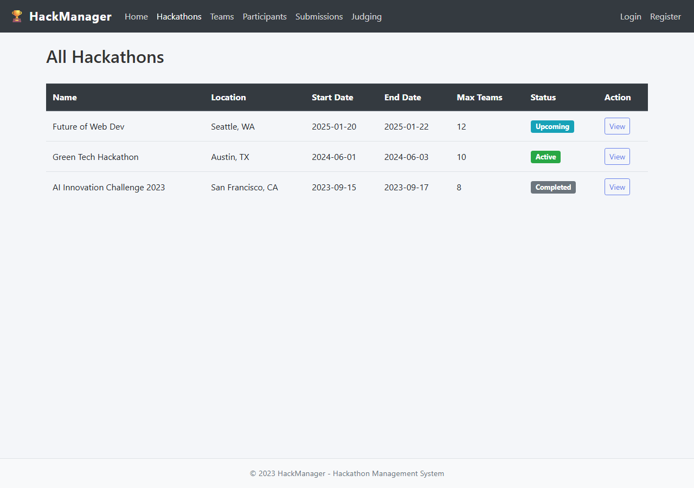
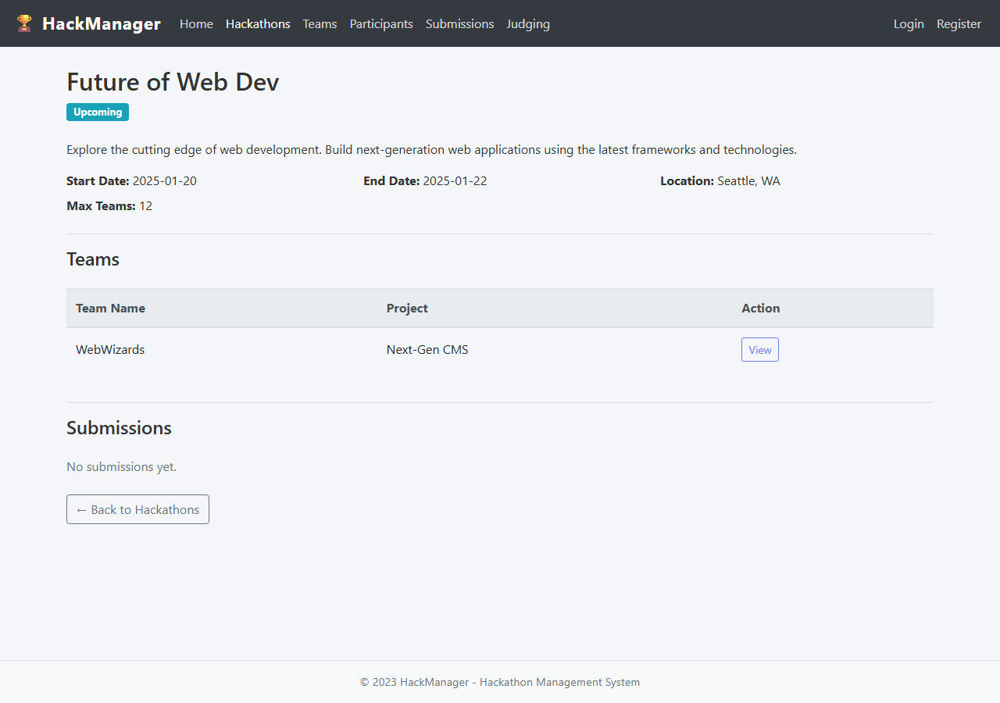
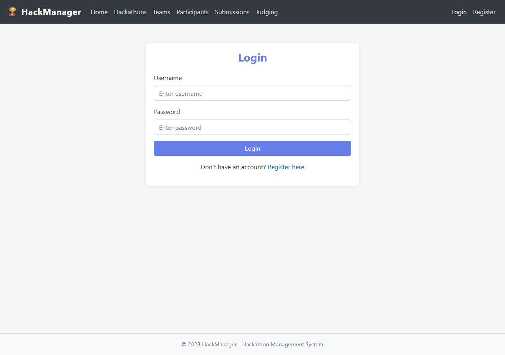

## Overview

This lab modernizes the HackManager application from Node.js 16 to Node.js 22 using Spec2Cloud and GitHub Copilot, then deploys it to Azure App Service. The legacy codebase uses Express with EJS templates and SQLite for storage.

## Understanding the Legacy Application

The legacy HackManager application is a Node.js 16 Express + EJS web app backed by SQLite. It provides a full hackathon management platform with user authentication, hackathon CRUD, team management, submissions, and judging. Below is what the application looks like when running with seed data.

The dashboard shows summary statistics (hackathons, teams, participants) and recent hackathon cards with status badges:

The hackathons list provides a tabular view of all hackathons with location, dates, capacity, and color-coded status badges (Upcoming, Active, Completed):

Each hackathon has a detail view showing description, dates, location, associated teams, and submissions:

### Authentication Flow

The application includes a standard authentication flow. The login page provides username/password authentication with a link to registration:

New users register with username, email, password, and password confirmation:

## Screenshots Reference

| Screenshot | Description |
|---|---|
|  | Dashboard with stats and hackathon cards |
|  | Tabular list of all hackathons |
|  | Individual hackathon detail view |
|  | Login form |
|  | Registration form |

## Solution Branch

The completed modernization is available on the **`solution-final`** branch with step-by-step tags:

| Step | Tag | Description |
|------|-----|-------------|
| 01 | `step-01-explore-legacy` | Explore legacy Node 16 codebase |
| 02 | `step-02-spec2cloud-analysis` | Spec2Cloud analysis of deprecated patterns |
| 03 | `step-03-migration-spec` | Generate migration specification |
| 04 | `step-04-update-node` | Update Node engine, replace better-sqlite3 with sql.js |
| 05 | `step-05-migrate-esm` | Convert CommonJS to ES Modules |
| 06 | `step-06-modernize-apis` | Replace moment.js, arrow functions, template literals |
| 07 | `step-07-update-deps` | Verify all dependencies at latest compatible versions |
| 08 | `step-08-build-test` | Add Node.js built-in test runner tests, verify app |

### Key Modernization Changes
- **CommonJS → ESM**: All `require()`/`module.exports` converted to `import`/`export`
- **body-parser → Express built-in**: `express.urlencoded()` and `express.json()`
- **moment.js → Native Intl API**: `Date.toLocaleDateString()` with Intl formatting
- **better-sqlite3 → sql.js**: Pure JS/WASM SQLite (no native compilation)
- **var → const/let**: Modern variable declarations
- **function() → arrow functions**: ES6+ callback syntax
- **Node.js built-in test runner**: Tests using `node:test` (9 tests passing)
- **Node 22 features verified**: `structuredClone`, global `fetch`, `import.meta.url`