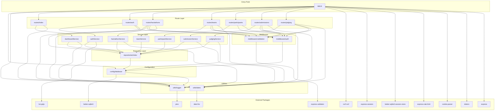

# Component Catalog — HackManager

_Extracted on 2026-03-30._

## Module Dependency Diagram

---

## Component: app.js (Application Entry Point)

- **Path:** `src/app.js`
- **Type:** Application bootstrap and middleware orchestrator
- **Responsibilities:**
  - Loads environment variables via dotenv
  - Initializes the database
  - Configures the Express application (view engine, body parsing, static files)
  - Wires the global middleware pipeline (session, CSRF, rate limiting)
  - Mounts all 7 route modules
  - Defines the 404 handler and global error handler
  - Starts the HTTP server (when run as main module)
- **Dependencies:** dotenv, express, path, express-session, cookie-parser, csrf-csrf, express-rate-limit, better-sqlite3-session-store, config/database, utils/logger, all 7 route modules
- **Dependents:** `tests/app.test.js`, Docker CMD
- **Integration points:** Session store (SQLite), CSRF cookie, rate limit state (in-memory)
- **Lines:** ~137

---

## Component: config/database.js (Database Configuration)

- **Path:** `src/config/database.js`
- **Type:** Infrastructure — database initialization and connection management
- **Responsibilities:**
  - Opens SQLite database connection at configurable path (`DATABASE_PATH` env var)
  - Creates the `data/` directory if it does not exist
  - Enables WAL journal mode and foreign key enforcement
  - Creates all 7 entity tables with `CREATE TABLE IF NOT EXISTS`
  - Exposes `getDb()` singleton accessor and `initDatabase()` initializer
- **Dependencies:** better-sqlite3, path, fs, utils/logger
- **Dependents:** app.js, repositories/index.js, middleware/auth.js, services/judgingService.js
- **Integration points:** SQLite file at `DATABASE_PATH` or `data/hackathon.db`

---

## Component: middleware/auth.js (Authentication Middleware)

- **Path:** `src/middleware/auth.js`
- **Type:** Cross-cutting middleware — authentication and authorization
- **Responsibilities:**
  - `requireAuth`: Redirects unauthenticated users to `/auth/login`
  - `requireJudge`: Enforces judge or admin role (returns 403 if denied)
  - `requireOwnerOrAdmin(resourceQuery)`: Factory function that creates ownership-checking middleware; executes the given SQL query with `req.params.id` and compares `created_by` to `req.session.user.id`; admin role bypasses the check
- **Dependencies:** config/database (lazy-loaded inside `requireOwnerOrAdmin`)
- **Dependents:** routes/hackathons.js, routes/teams.js, routes/participants.js, routes/submissions.js, routes/judging.js

---

## Component: middleware/validation.js (Input Validation)

- **Path:** `src/middleware/validation.js`
- **Type:** Cross-cutting middleware — request validation
- **Responsibilities:**
  - Defines validation rule arrays for each form: `loginRules`, `registerRules`, `hackathonRules`, `teamRules`, `submissionRules`, `scoreRules`
  - `handleValidationErrors`: Middleware that checks `validationResult(req)` and returns 400 with error messages if validation fails
- **Dependencies:** express-validator
- **Dependents:** routes/auth.js, routes/hackathons.js, routes/teams.js, routes/submissions.js, routes/judging.js

---

## Component: repositories/index.js (Data Access Layer)

- **Path:** `src/repositories/index.js`
- **Type:** Data access — SQL query encapsulation
- **Responsibilities:**
  - Provides 7 repository objects: `userRepo`, `hackathonRepo`, `teamRepo`, `participantRepo`, `submissionRepo`, `judgeRepo`, `scoreRepo`
  - Each repository exposes named methods (e.g., `findById`, `findAll`, `create`, `update`, `delete`, `count`)
  - All SQL is contained within this file — no raw SQL exists elsewhere in routes or services
  - Uses better-sqlite3 prepared statements for parameterized queries
  - Includes JOIN queries for cross-entity reads (e.g., teams with hackathon names, submissions with scores and judge usernames)
- **Dependencies:** config/database
- **Dependents:** All 7 services
- **Entity coverage:**

| Repository | Methods |
|-----------|---------|
| `userRepo` | `findByUsername`, `create` |
| `hackathonRepo` | `findAll`, `findRecent`, `findById`, `create`, `update`, `delete`, `count` |
| `teamRepo` | `findAll`, `findById`, `findByHackathon`, `findMembers`, `create`, `count` |
| `participantRepo` | `findAll`, `create`, `count` |
| `submissionRepo` | `findAll`, `findById`, `findByHackathon`, `findScores`, `create` |
| `judgeRepo` | `findByUserAndHackathon`, `create` |
| `scoreRepo` | `create` |

---

## Component: services/authService.js

- **Path:** `src/services/authService.js`
- **Type:** Business logic — authentication
- **Responsibilities:**
  - `authenticate(username, password)`: Looks up user by username, compares password with bcrypt (async), returns sanitized user object (id, username, email, role) or null
  - `register(username, email, password, role)`: Hashes password with bcrypt (10 rounds, async), inserts user via repository
- **Dependencies:** bcryptjs, repositories (userRepo)
- **Dependents:** routes/auth.js

---

## Component: services/hackathonService.js

- **Path:** `src/services/hackathonService.js`
- **Type:** Business logic — hackathon management
- **Responsibilities:**
  - `getAll()`: Fetches all hackathons with formatted dates
  - `getById(id)`: Fetches hackathon + associated teams + submissions
  - `create(data)`, `update(id, data)`, `delete(id)`: CRUD delegation to repository
- **Dependencies:** repositories (hackathonRepo, teamRepo, submissionRepo), utils/dates
- **Dependents:** routes/hackathons.js

---

## Component: services/dashboardService.js

- **Path:** `src/services/dashboardService.js`
- **Type:** Business logic — dashboard statistics
- **Responsibilities:**
  - `getStats()`: Aggregates counts from hackathon, team, and participant repositories; fetches 3 most recent hackathons with formatted dates
- **Dependencies:** repositories (hackathonRepo, teamRepo, participantRepo), utils/dates
- **Dependents:** routes/index.js

---

## Component: services/teamService.js

- **Path:** `src/services/teamService.js`
- **Type:** Business logic — team management
- **Responsibilities:**
  - `getAll()`: Fetches all teams with hackathon names
  - `getById(id)`: Fetches team + members + associated hackathon
  - `getNewTeamForm(hackathonId)`: Fetches hackathon for form context
  - `create(data)`: Delegates to repository
- **Dependencies:** repositories (teamRepo, hackathonRepo)
- **Dependents:** routes/teams.js

---

## Component: services/participantService.js

- **Path:** `src/services/participantService.js`
- **Type:** Business logic — participant management
- **Responsibilities:**
  - `getAll()`: Fetches all participants with joined user/hackathon/team names
  - `join(userId, teamId, hackathonId)`: Creates a participant record
- **Dependencies:** repositories (participantRepo)
- **Dependents:** routes/participants.js

---

## Component: services/submissionService.js

- **Path:** `src/services/submissionService.js`
- **Type:** Business logic — submission management
- **Responsibilities:**
  - `getAll()`: Fetches all submissions with team/hackathon names
  - `getById(id)`: Fetches submission with formatted date + associated scores
  - `getNewForm(hackathonId)`: Fetches hackathon + teams for form context
  - `create(data)`: Delegates to repository
- **Dependencies:** repositories (submissionRepo, hackathonRepo, teamRepo), utils/dates
- **Dependents:** routes/submissions.js

---

## Component: services/judgingService.js

- **Path:** `src/services/judgingService.js`
- **Type:** Business logic — judging and scoring
- **Responsibilities:**
  - `getSubmissions()`: Fetches all submissions for the judging dashboard
  - `getSubmissionForScoring(id)`: Fetches a single submission with joined names
  - `scoreSubmission(submissionId, userId, scores)`: Orchestrates the scoring flow — looks up submission, finds or creates a judge record for the user+hackathon pair, calculates overall score as the average of 4 category scores, inserts the score record
- **Dependencies:** repositories (submissionRepo, judgeRepo, scoreRepo), config/database (direct access for raw submission lookup)
- **Dependents:** routes/judging.js
- **Note:** This service directly accesses `config/database.getDb()` for a raw submission query in addition to using repository methods. This is the only service that bypasses the repository layer.

---

## Component: utils/logger.js (Structured Logging)

- **Path:** `src/utils/logger.js`
- **Type:** Utility — logging
- **Responsibilities:**
  - Creates a pino logger instance
  - Uses pino-pretty transport in non-production environments (colorized output)
  - Uses raw JSON output in production
  - Log level configurable via `LOG_LEVEL` env var (default: `info`)
- **Dependencies:** pino
- **Dependents:** app.js, config/database.js, all 7 route files

---

## Component: utils/dates.js (Date Formatting)

- **Path:** `src/utils/dates.js`
- **Type:** Utility — date formatting
- **Responsibilities:**
  - `formatDate(dateStr)`: Formats ISO date string to `"MMM d, yyyy"` (e.g., "Mar 15, 2024")
  - `formatDateTime(dateStr)`: Formats to `"MMM d, yyyy h:mm a"` (e.g., "Mar 15, 2024 2:30 PM")
  - `formatHackathonDates(hackathon)`: Adds `start_date_formatted` and `end_date_formatted` properties to a hackathon object
- **Dependencies:** date-fns (format, parseISO)
- **Dependents:** services/dashboardService.js, services/hackathonService.js, services/submissionService.js

---

## Component: Route Modules (7 routers)

All route modules follow the same structure: create an Express router, import service(s) and middleware, define route handlers as thin controllers, export the router.

| Router | Path | Public Routes | Protected Routes | Middleware Used |
|--------|------|--------------|-----------------|----------------|
| `routes/index.js` | `/` | GET `/` | — | — |
| `routes/auth.js` | `/auth` | GET `/login`, GET `/register` | POST `/login`, POST `/register`, GET `/logout` | loginRules, registerRules, handleValidationErrors |
| `routes/hackathons.js` | `/` | GET `/hackathons`, GET `/hackathons/:id` | GET `/hackathons/new`, POST `/hackathons`, GET `/hackathons/:id/edit`, POST `/hackathons/:id/update`, POST `/hackathons/:id/delete` | requireAuth, hackathonOwnerCheck, hackathonRules, handleValidationErrors |
| `routes/teams.js` | `/` | GET `/teams`, GET `/teams/:id` | GET `/hackathons/:hId/teams/new`, POST `/hackathons/:hId/teams` | requireAuth, teamRules, handleValidationErrors |
| `routes/participants.js` | `/` | GET `/participants` | POST `/hackathons/:hId/participants/join` | requireAuth |
| `routes/submissions.js` | `/` | GET `/submissions`, GET `/submissions/:id` | GET `/hackathons/:hId/submissions/new`, POST `/hackathons/:hId/submissions` | requireAuth, submissionRules, handleValidationErrors |
| `routes/judging.js` | `/` | — | GET `/judging`, GET `/submissions/:id/judge`, POST `/submissions/:id/score` | requireAuth, requireJudge, scoreRules, handleValidationErrors |

---

## Component: Views (EJS Templates)

- **Path:** `src/views/`
- **Type:** Presentation — server-side HTML templates
- **Responsibilities:** Render HTML pages using data passed from route handlers
- **Layout:** `layout/header.ejs` (nav + alerts) and `layout/footer.ejs` (scripts) are included in every page template via `<%- include() %>`
- **Template variables available globally:** `user` (session user or null), `csrfToken` (CSRF token for forms)

| Directory | Templates | Purpose |
|-----------|----------|---------|
| `layout/` | header.ejs, footer.ejs | Shared navigation, Bootstrap 5 CDN links, alert rendering |
| `auth/` | login.ejs, register.ejs | Authentication forms with CSRF tokens |
| `hackathons/` | index.ejs, show.ejs, new.ejs, edit.ejs | Hackathon list, detail, create, edit forms |
| `teams/` | index.ejs, show.ejs, new.ejs | Team list, detail, create form |
| `participants/` | index.ejs | Participant list |
| `submissions/` | index.ejs, show.ejs, new.ejs | Submission list, detail with scores, create form |
| `judging/` | index.ejs, score.ejs | Judging dashboard, scoring form |
| (root) | index.ejs, error.ejs | Dashboard, error page |

---

## Component: Public Assets

- **Path:** `src/public/`
- **Type:** Static files — client-side CSS and JavaScript
- **Contents:**
  - `css/style.css`: Custom styles supplementing Bootstrap
  - `js/main.js`: Client-side JavaScript (auto-dismiss flash alerts, form confirmations)
- **Served by:** `express.static()` middleware in app.js
