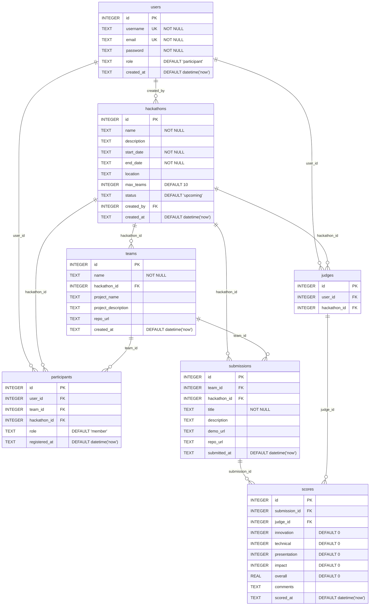

# Data Models

## Entity-Relationship Diagram

## Table Definitions

All tables are defined in `src/config/database.js` within the `initDatabase()` function using `CREATE TABLE IF NOT EXISTS` statements. Schema is applied on every application startup.

### users
| Column | Type | Constraints | Description |
|--------|------|-------------|-------------|
| id | INTEGER | PRIMARY KEY AUTOINCREMENT | User identifier |
| username | TEXT | UNIQUE NOT NULL | Login username |
| email | TEXT | UNIQUE NOT NULL | User email address |
| password | TEXT | NOT NULL | bcrypt-hashed password (salt rounds 10) |
| role | TEXT | DEFAULT 'participant' | One of: participant, judge, admin |
| created_at | TEXT | DEFAULT datetime('now') | ISO timestamp |

### hackathons
| Column | Type | Constraints | Description |
|--------|------|-------------|-------------|
| id | INTEGER | PRIMARY KEY AUTOINCREMENT | Hackathon identifier |
| name | TEXT | NOT NULL | Hackathon name |
| description | TEXT | — | Event description |
| start_date | TEXT | NOT NULL | Start date (ISO format) |
| end_date | TEXT | NOT NULL | End date (ISO format) |
| location | TEXT | — | Event location |
| max_teams | INTEGER | DEFAULT 10 | Maximum number of teams allowed |
| status | TEXT | DEFAULT 'upcoming' | One of: upcoming, active, completed |
| created_by | INTEGER | REFERENCES users(id) | Creator user ID |
| created_at | TEXT | DEFAULT datetime('now') | ISO timestamp |

### teams
| Column | Type | Constraints | Description |
|--------|------|-------------|-------------|
| id | INTEGER | PRIMARY KEY AUTOINCREMENT | Team identifier |
| name | TEXT | NOT NULL | Team display name |
| hackathon_id | INTEGER | REFERENCES hackathons(id) | Associated hackathon |
| project_name | TEXT | — | Name of team's project |
| project_description | TEXT | — | Project description |
| repo_url | TEXT | — | Source code repository URL |
| created_at | TEXT | DEFAULT datetime('now') | ISO timestamp |

### participants
| Column | Type | Constraints | Description |
|--------|------|-------------|-------------|
| id | INTEGER | PRIMARY KEY AUTOINCREMENT | Participation record identifier |
| user_id | INTEGER | REFERENCES users(id) | Participating user |
| team_id | INTEGER | REFERENCES teams(id) | Team membership (nullable) |
| hackathon_id | INTEGER | REFERENCES hackathons(id) | Associated hackathon |
| role | TEXT | DEFAULT 'member' | Team role: leader or member |
| registered_at | TEXT | DEFAULT datetime('now') | Registration timestamp |

### submissions
| Column | Type | Constraints | Description |
|--------|------|-------------|-------------|
| id | INTEGER | PRIMARY KEY AUTOINCREMENT | Submission identifier |
| team_id | INTEGER | REFERENCES teams(id) | Submitting team |
| hackathon_id | INTEGER | REFERENCES hackathons(id) | Associated hackathon |
| title | TEXT | NOT NULL | Submission title |
| description | TEXT | — | Project description |
| demo_url | TEXT | — | Live demo URL |
| repo_url | TEXT | — | Source repository URL |
| submitted_at | TEXT | DEFAULT datetime('now') | Submission timestamp |

### judges
| Column | Type | Constraints | Description |
|--------|------|-------------|-------------|
| id | INTEGER | PRIMARY KEY AUTOINCREMENT | Judge assignment identifier |
| user_id | INTEGER | REFERENCES users(id) | Judge user |
| hackathon_id | INTEGER | REFERENCES hackathons(id) | Judging assignment scope |

### scores
| Column | Type | Constraints | Description |
|--------|------|-------------|-------------|
| id | INTEGER | PRIMARY KEY AUTOINCREMENT | Score record identifier |
| submission_id | INTEGER | REFERENCES submissions(id) | Scored submission |
| judge_id | INTEGER | REFERENCES judges(id) | Scoring judge |
| innovation | INTEGER | DEFAULT 0 | Innovation score (0–10) |
| technical | INTEGER | DEFAULT 0 | Technical score (0–10) |
| presentation | INTEGER | DEFAULT 0 | Presentation score (0–10) |
| impact | INTEGER | DEFAULT 0 | Impact score (0–10) |
| overall | REAL | DEFAULT 0 | Calculated average: (innovation + technical + presentation + impact) / 4 |
| comments | TEXT | — | Judge comments |
| scored_at | TEXT | DEFAULT datetime('now') | Scoring timestamp |

## Data Integrity Notes

- Foreign keys are declared in the schema via `REFERENCES` clauses
- **Foreign key enforcement is NOT enabled at runtime** — `PRAGMA foreign_keys = ON` is only in `seeds/seed.js`, not in `src/config/database.js`
- No unique constraints on composite keys (e.g., one submission per team per hackathon is not enforced)
- No check constraints on score ranges (0–10 enforced only in application code via `parseInt() || 0`)
- Dates stored as TEXT in ISO format — no date type validation
- WAL journal mode enabled for better concurrent read performance

## Seed Data

Defined in `seeds/seed.js` (run via `npm run seed`):

| Entity | Count | Notes |
|--------|-------|-------|
| Users | 8 | 1 admin, 2 judges, 5 participants |
| Hackathons | 3 | completed, active, upcoming |
| Teams | 5 | 2–3 teams per hackathon |
| Participants | 10 | Distributed across teams |
| Submissions | 3 | From first 3 teams |
| Judges | 2 | Both assigned to first hackathon |
| Scores | 4 | 2 judges × 2 submissions |
