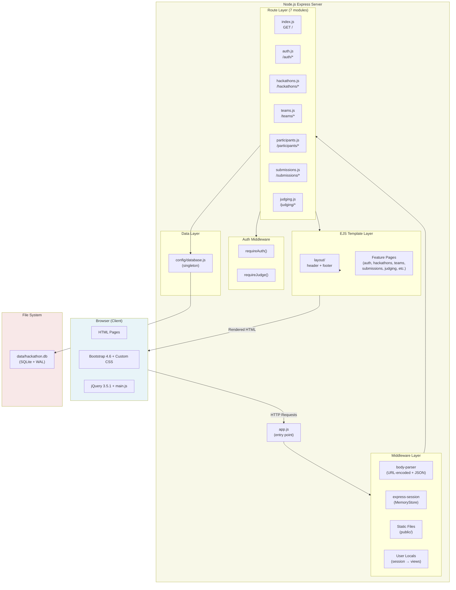
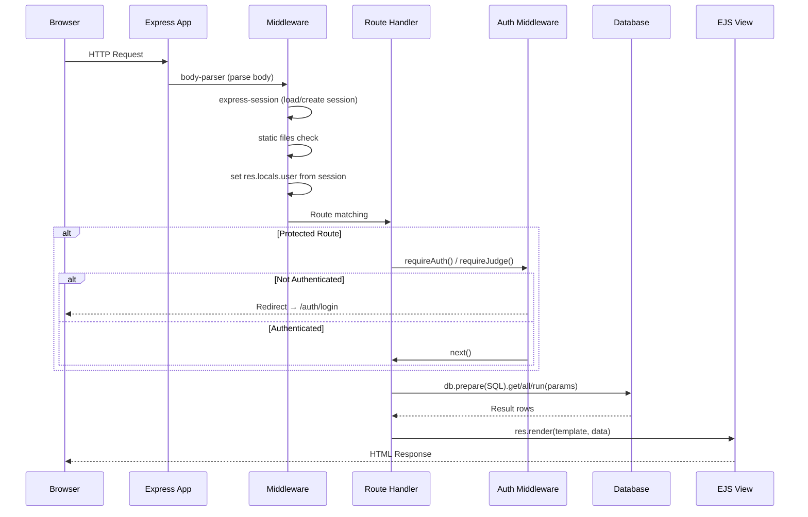

# Architecture Overview

## System Architecture

## Request Flow

## Component Inventory

### Entry Point
- **`src/app.js`** — Express application setup; mounts all middleware and routes; starts HTTP server on `PORT` (default 3000)

### Middleware (applied in order)
1. **`body-parser.urlencoded`** — Parses URL-encoded form bodies
2. **`body-parser.json`** — Parses JSON request bodies
3. **`express-session`** — Session management with hardcoded secret, MemoryStore
4. **`express.static`** — Serves `src/public/` (CSS, JS)
5. **User locals** — Copies `req.session.user` to `res.locals.user` for all views
6. **404 handler** — Creates "Not Found" error for unmatched routes
7. **Error handler** — Renders `error.ejs` with error details

### Auth Middleware (`src/middleware/auth.js`)
- **`requireAuth`** — Checks `req.session.user` exists; redirects to `/auth/login` if missing
- **`requireJudge`** — Checks `req.session.user.role` is `'judge'` or `'admin'`; returns 403 if not

### Route Modules (7 files in `src/routes/`)
| Module | Mount Point | Responsibilities |
|--------|------------|-----------------|
| `index.js` | `/` | Dashboard with aggregate stats and recent hackathons |
| `auth.js` | `/auth` | Login, register, logout; session creation/destruction |
| `hackathons.js` | `/` | CRUD for hackathons; date formatting with moment.js |
| `teams.js` | `/` | Create and view teams; member listing |
| `participants.js` | `/` | List participants; join hackathon |
| `submissions.js` | `/` | Submit projects; view with scores |
| `judging.js` | `/` | Score submissions; auto-create judge records |

### View Layer (EJS)
- **Layout partials**: `header.ejs` (navbar, CDN links), `footer.ejs` (scripts, CDN links)
- **Per-feature directories**: Each route module has corresponding views in `src/views/{feature}/`
- **Shared templates**: `index.ejs` (dashboard), `error.ejs` (error page)

### Data Layer
- **`src/config/database.js`** — Singleton pattern; `initDatabase()` creates tables, `getDb()` returns instance
- **No ORM/query builder** — Raw SQL via `better-sqlite3` prepared statements
- **No repository pattern** — SQL queries inline in route handlers
- **No service layer** — Business logic embedded in route handlers

## Architecture Characteristics

| Characteristic | Current State |
|---------------|---------------|
| **Pattern** | Traditional server-rendered MPA (monolithic) |
| **Layering** | 2-layer: Routes → Database (no service/repository layers) |
| **State management** | Server-side sessions (express-session MemoryStore) |
| **Authentication** | Session-based with bcrypt password hashing |
| **Authorization** | Middleware-level (requireAuth, requireJudge); no resource-level ownership checks |
| **API style** | HTML-form POST (no REST API, no JSON endpoints) |
| **Data access** | Synchronous SQLite via prepared statements |
| **Error handling** | try/catch in routes; generic error rendering |
| **Logging** | `console.log` / `console.error` only |
| **Configuration** | Mostly hardcoded; only PORT from env |
| **Scalability** | Single-process, file-based DB, in-memory sessions — not horizontally scalable |

## Integration Points

| Integration | Type | Direction |
|------------|------|-----------|
| SQLite database | File I/O | Read/Write |
| CDN (jsdelivr.net) | HTTP | Outbound (client-side only) |

No external API integrations, no message queues, no caching layers, no third-party services.
