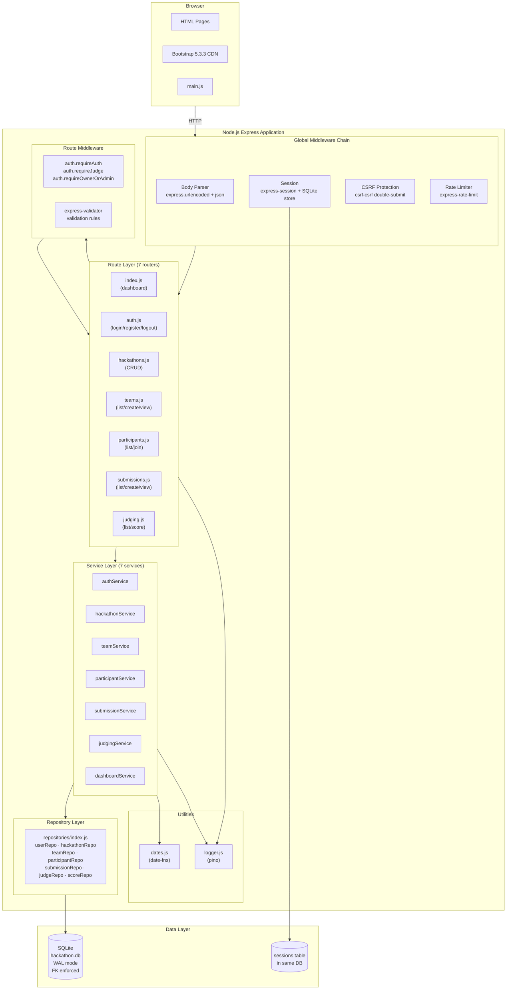
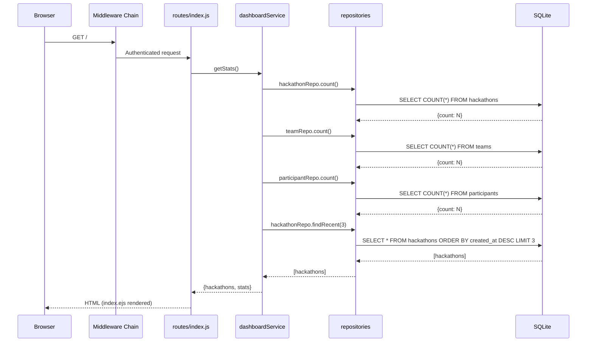
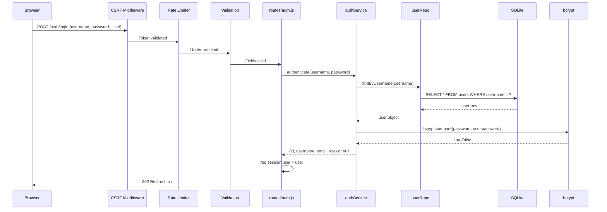
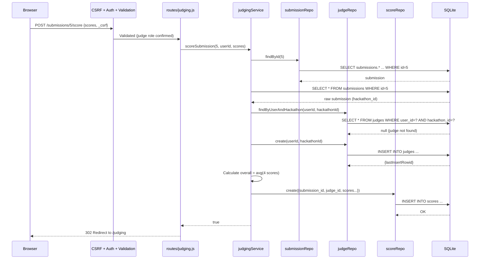
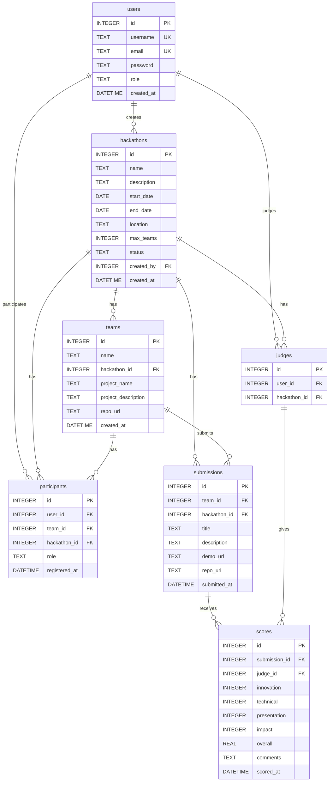

# Architecture Overview — HackManager

_Extracted on 2026-03-30. Documents the architecture as it exists in the modernized codebase._

## System Boundaries

HackManager is a **single-process monolithic web application** — one deployable unit.

| Property | Value |
|----------|-------|
| **Name** | HackManager |
| **Runtime** | Node.js ≥22.0.0 |
| **Entry point** | `src/app.js` |
| **Framework** | Express 4.18 |
| **View engine** | EJS (server-side rendered) |
| **Database** | SQLite via better-sqlite3 12.x |
| **Deployment artifact** | Docker container (node:22-alpine) or bare Node.js process |

There are no separate microservices, workers, or background processes. All HTTP request handling, session management, and database access occur within the single Express process.

## High-Level Architecture

The application follows a **layered monolith** pattern: Routes → Services → Repositories → Database. Routes act as thin controllers (≤15 lines), delegating business logic to services. Repositories encapsulate all SQL queries. The layers communicate through direct function calls — there are no event buses, message queues, or inter-process communication.

## Middleware Pipeline

Every HTTP request passes through the global middleware chain in this exact order:

```mermaid
flowchart LR
    REQ["HTTP Request"] --> BP["1. Body Parser"]
    BP --> SESS["2. Session"]
    SESS --> STATIC["3. Static Files"]
    STATIC --> USER["4. res.locals.user"]
    USER --> COOKIE["5. Cookie Parser"]
    COOKIE --> CSRFGEN["6. CSRF Token Gen"]
    CSRFGEN --> CSRFVAL["7. CSRF Validate"]
    CSRFVAL --> RATE["8. Rate Limit<br/>(auth routes only)"]
    RATE --> ROUTE["9. Route Handler"]
    ROUTE --> ERR["10. Error Handler"]
    ERR --> RES["HTTP Response"]

    style CSRFVAL fill:#f9f,stroke:#333
    style RATE fill:#ff9,stroke:#333
    style ERR fill:#f66,stroke:#333
```

| Order | Middleware | Source | Applies To |
|-------|-----------|--------|-----------|
| 1 | `express.urlencoded()` + `express.json()` | app.js:30–31 | All requests |
| 2 | `express-session` (SQLite store) | app.js:35–41 | All requests |
| 3 | `express.static()` | app.js:44 | All requests |
| 4 | `res.locals.user` injection | app.js:47–50 | All requests |
| 5 | `cookieParser()` | app.js:53 | All requests |
| 6 | `generateCsrfToken` → `res.locals.csrfToken` | app.js:62–66 | All requests |
| 7 | `doubleCsrfProtection` | app.js:69 | POST/PUT/DELETE |
| 8a | `authLoginLimiter` (10 req/15min) | app.js:99 | POST /auth/login |
| 8b | `authRegisterLimiter` (5 req/15min) | app.js:100 | POST /auth/register |
| 9 | Route handlers (+ route-specific middleware) | app.js:98–106 | Matched routes |
| 10 | Error handler (CSRF + generic) | app.js:116–130 | Uncaught errors |

## Data Flow

### Typical Read Flow (GET / — Dashboard)

### Typical Write Flow (POST /auth/login)

### Complex Write Flow (POST /submissions/:id/score)

## Integration Points

| Type | Technology | Version | Config Source | Used By |
|------|-----------|---------|---------------|---------|
| Database | SQLite (better-sqlite3) | 12.8.0 | `DATABASE_PATH` env var, default: `data/hackathon.db` | All repositories, session store |
| Session Store | better-sqlite3-session-store | 0.1.0 | `SESSION_SECRET` env var | express-session (app.js) |
| Password Hashing | bcryptjs | 2.4.3 | Hardcoded: 10 salt rounds, async | authService |
| CSRF Protection | csrf-csrf | 4.0.3 | `SESSION_SECRET` env var, cookie: `_csrf` | All POST/PUT/DELETE routes |
| Rate Limiting | express-rate-limit | 8.3.2 | Hardcoded thresholds | /auth/login, /auth/register |
| Input Validation | express-validator | 7.3.1 | Per-route rule sets | All POST routes |
| Logging | pino + pino-pretty | 10.x | `LOG_LEVEL` env var, `NODE_ENV` for transport | All modules |
| Date Formatting | date-fns | 4.1.0 | N/A | dashboardService, hackathonService, submissionService |
| View Rendering | EJS | 3.1.9 | `src/views/` directory | All route handlers |
| CSS Framework | Bootstrap (CDN) | 5.3.3 | Hardcoded CDN URL in header.ejs | Client-side |
| Static Assets | Express static middleware | — | `src/public/` directory | Client-side |
| Environment Config | dotenv | 17.3.1 | `.env` file | app.js (first line) |

### Environment Variables

| Variable | Required | Default | Used In |
|----------|----------|---------|---------|
| `SESSION_SECRET` | Yes (production) | `'hackathon-dev-fallback-secret'` | app.js (session, CSRF) |
| `PORT` | No | `3000` | app.js |
| `DATABASE_PATH` | No | `data/hackathon.db` | config/database.js |
| `NODE_ENV` | No | `development` | app.js (error handler), logger.js (transport) |
| `LOG_LEVEL` | No | `'info'` | utils/logger.js |

## Database Schema

7 entity tables + 1 `sessions` table (managed by better-sqlite3-session-store). Foreign key constraints are enforced at runtime via `PRAGMA foreign_keys = ON`. WAL journaling mode is enabled for concurrent read performance.

## Architectural Patterns Observed

| Pattern | Evidence |
|---------|----------|
| **Layered monolith** | Four distinct layers: Routes → Services → Repositories → Database. Import direction flows strictly downward. |
| **MVC (variant)** | Routes act as controllers, services contain model logic, EJS views render HTML. No formal "Model" class — repositories return plain objects. |
| **Repository pattern** | `src/repositories/index.js` encapsulates all SQL queries behind named methods per entity. No raw SQL appears in routes or services. |
| **Service layer** | `src/services/` contains one service per feature area. Services compose repository calls and contain business logic (score calculation, date formatting, auth flow). |
| **Middleware chain** | Express middleware pipeline handles cross-cutting concerns (auth, CSRF, rate limiting, validation) before route handlers execute. |
| **Factory middleware** | `requireOwnerOrAdmin(resourceQuery)` is a factory function that returns a middleware closure parameterized by SQL query. |
| **Server-side rendering** | All HTML generated server-side via EJS templates. No client-side SPA framework. No AJAX/fetch calls. |
| **Singleton database** | Single SQLite connection held in `config/database.js` module scope. All repositories share this connection via `getDb()`. |
