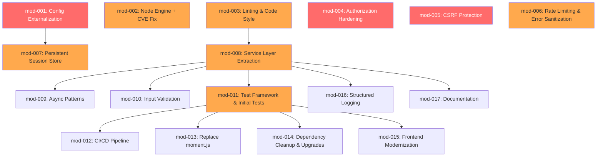

# Increment Plan

> **Generated from**: Modernization assessment (`specs/assessment/modernization.md`)
> **ADR compliance**: ADR-001 (incremental refactor), ADR-002 (Node.js 22 LTS)
> **Track**: B (non-testable — zero existing tests; manual verification until mod-011)

## Dependency Graph

---

## mod-001: Externalize Configuration & Database Hardening

- **Type:** modernization
- **Findings:** S1 (Critical), C2 (Medium), A4 (Medium)
- **Scope:** Add `dotenv` dependency. Move hardcoded session secret to `process.env.SESSION_SECRET`. Move database path to `process.env.DATABASE_PATH`. Add `process.env.NODE_ENV` usage. Create `.env.example` with all required variables. Add `db.pragma('foreign_keys = ON')` to `database.js`. Fail app startup if `SESSION_SECRET` is missing in production. No feature changes, no route changes.
- **Acceptance Criteria:**
  - [ ] Session secret loaded from `SESSION_SECRET` env var
  - [ ] Database path configurable via `DATABASE_PATH` env var (with fallback to `data/hackathon.db`)
  - [ ] `.env.example` exists with all required/optional variables documented
  - [ ] `.env` is in `.gitignore` (already is)
  - [ ] App fails to start if `SESSION_SECRET` is missing and `NODE_ENV=production`
  - [ ] `PRAGMA foreign_keys = ON` executes on every database initialization
  - [ ] App starts and serves pages identically to before
- **Test Strategy:**
  - Manual: Start app with `.env` file, verify all pages load
  - Manual: Start app without `SESSION_SECRET` in production mode, verify startup fails
  - Manual: Insert a row violating a foreign key, verify rejection
- **Behavioral Deltas:**
  - New: App rejects startup without `SESSION_SECRET` in production mode (new guard)
  - New: Database rejects foreign key violations at runtime (previously silent)
  - Regression: All existing pages render identically; all forms still work
  - Manual verification:
    - [ ] Homepage loads with stats
    - [ ] Login/register works
    - [ ] Create/edit/delete hackathon works
    - [ ] Foreign key violation rejected (e.g., create team with invalid hackathon_id)
- **Dependencies:** none
- **Rollback Plan:** Remove `dotenv` require, revert to hardcoded session secret, remove pragma line. `git checkout src/app.js src/config/database.js package.json`
- **Risk:** Low — configuration changes only; fallback values preserve current behavior

---

## mod-002: Node Engine & Dev Tooling Update

- **Type:** modernization
- **Findings:** C3 (Low), D3 (High — CVE), D7 (Low)
- **Scope:** Update `package.json` engines from `>=16.0.0` to `>=22.0.0` per ADR-002. Add `.nvmrc` file with `22`. Upgrade `nodemon` from 2.x to 3.x (resolves semver ReDoS CVE GHSA-c2qf-rxjj-qqgw). No application code changes.
- **Acceptance Criteria:**
  - [ ] `package.json` engines field reads `"node": ">=22.0.0"`
  - [ ] `.nvmrc` file exists with content `22`
  - [ ] `npm audit` reports 0 vulnerabilities
  - [ ] `npm run dev` starts successfully with nodemon 3.x
  - [ ] App starts and serves pages identically
- **Test Strategy:**
  - Manual: `npm audit` shows 0 vulnerabilities
  - Manual: `npm run dev` auto-restarts on file change
  - Manual: Verify `node --version` is 22.x
- **Behavioral Deltas:**
  - Unchanged: Zero application behavior changes
  - Manual verification:
    - [ ] `npm audit` clean
    - [ ] `npm run dev` works with hot reload
- **Dependencies:** none
- **Rollback Plan:** Revert `package.json` engines, delete `.nvmrc`, `npm install nodemon@2 --save-dev`
- **Risk:** Low — no application code changes; nodemon 3.x is backward-compatible for our use case

---

## mod-003: Linting & Code Style

- **Type:** modernization
- **Findings:** T2 (High), P6 (Low), P3 (Medium)
- **Scope:** Add ESLint and Prettier configuration files. Add `lint` and `lint:fix` scripts to `package.json`. Run autofix to convert `var` → `const`/`let` and standardize arrow function style. No behavioral changes — purely syntactic transformations.
- **Acceptance Criteria:**
  - [ ] `.eslintrc.json` (or `.eslintrc.cjs`) exists with Node.js recommended rules
  - [ ] `.prettierrc` exists with project conventions
  - [ ] `npm run lint` executes without errors after autofix
  - [ ] All `var` declarations converted to `const` or `let`
  - [ ] Consistent function style (arrow functions for callbacks)
  - [ ] App starts and serves pages identically
- **Test Strategy:**
  - Run `npm run lint` — zero errors
  - Manual: Verify app starts and all pages render correctly
- **Behavioral Deltas:**
  - Unchanged: Zero application behavior changes (syntactic only)
  - Manual verification:
    - [ ] `npm run lint` passes
    - [ ] App starts without errors
    - [ ] Homepage, login, hackathon list all render correctly
- **Dependencies:** none
- **Rollback Plan:** Remove ESLint/Prettier configs, revert autofix changes. `git checkout src/`
- **Risk:** Low — autofix is well-understood; `var`→`const`/`let` is safe for this codebase (no hoisting tricks observed)

---

## mod-004: Authorization Hardening (IDOR Fix)

- **Type:** modernization
- **Findings:** S3 (Critical)
- **Scope:** Add ownership verification to all mutating endpoints. Hackathon edit/update/delete: verify `req.session.user.id === hackathon.created_by` or user is admin. Team/submission creation: verify user is participant of the hackathon. Judging list: add `requireAuth` middleware. No changes to read-only endpoints.
- **Acceptance Criteria:**
  - [ ] POST `/hackathons/:id/update` rejects if user is not creator or admin (403)
  - [ ] POST `/hackathons/:id/delete` rejects if user is not creator or admin (403)
  - [ ] GET `/judging` requires authentication
  - [ ] Admin role bypasses ownership checks
  - [ ] Error pages show user-friendly "not authorized" message
  - [ ] All read-only GET endpoints remain publicly accessible
- **Test Strategy:**
  - Manual: Log in as non-creator participant, attempt to edit another user's hackathon → 403
  - Manual: Log in as admin, edit any hackathon → success
  - Manual: Visit /judging while logged out → redirect to login
- **Behavioral Deltas:**
  - Modified: Hackathon edit/delete now restricted to creator or admin (was: any authenticated user)
  - Modified: Judging list now requires authentication (was: public)
  - New: 403 "Not Authorized" response for unauthorized mutation attempts
  - Regression: All read-only pages unchanged; admin can still do everything
  - Manual verification:
    - [ ] Non-owner gets 403 on edit/delete hackathon
    - [ ] Creator can still edit/delete own hackathon
    - [ ] Admin can edit/delete any hackathon
    - [ ] Judging list requires login
    - [ ] All public GET pages still work without login
- **Dependencies:** none
- **Rollback Plan:** Revert route files to remove ownership checks. `git checkout src/routes/hackathons.js src/routes/judging.js`
- **Risk:** Medium — changes authorization behavior; must verify admin bypass works; may affect user workflows

---

## mod-005: CSRF Protection

- **Type:** modernization
- **Findings:** S2 (Critical)
- **Scope:** Add CSRF protection middleware (csrf-csrf or csurf alternative). Generate CSRF tokens and inject into all EJS forms as hidden fields. Validate CSRF tokens on all POST requests. No changes to GET endpoints.
- **Acceptance Criteria:**
  - [ ] All POST forms include a hidden CSRF token field
  - [ ] POST requests without valid CSRF token receive 403
  - [ ] All existing form submissions still work with valid tokens
  - [ ] CSRF token available in all EJS templates via `res.locals`
  - [ ] Error page displayed for CSRF validation failures
- **Test Strategy:**
  - Manual: Submit login form → success (token present)
  - Manual: Craft a POST request without CSRF token (curl) → 403 rejection
  - Manual: Test all forms: login, register, create/edit/delete hackathon, create team, join hackathon, create submission, score submission
- **Behavioral Deltas:**
  - New: All forms now include CSRF token hidden field
  - New: POST requests without valid CSRF token are rejected (403)
  - Regression: All form submissions with valid tokens work identically
  - Manual verification:
    - [ ] Login form submits successfully
    - [ ] Registration form submits successfully
    - [ ] Hackathon create/edit/delete all work
    - [ ] Team creation works
    - [ ] Submission creation works
    - [ ] Score submission works
    - [ ] curl POST without token → 403
- **Dependencies:** none
- **Rollback Plan:** Remove CSRF middleware from `app.js`, remove hidden fields from EJS templates. `git checkout src/app.js src/views/`
- **Risk:** Medium — touches all forms; must verify every POST endpoint still works; may break any non-browser clients

---

## mod-006: Rate Limiting & Error Sanitization

- **Type:** modernization
- **Findings:** S5 (Medium), S6 (Medium)
- **Scope:** Add `express-rate-limit` on `/auth/login` and `/auth/register` (max 10 attempts per 15 min window). Sanitize error handler to never send stack traces when `NODE_ENV=production`. Show generic error message in production, detailed in development.
- **Acceptance Criteria:**
  - [ ] `/auth/login` rate-limited to 10 requests per 15 minutes per IP
  - [ ] `/auth/register` rate-limited to 5 requests per 15 minutes per IP
  - [ ] Rate limit exceeded returns 429 with user-friendly message
  - [ ] Error handler in production mode shows generic message, no stack trace
  - [ ] Error handler in development mode still shows full error details
- **Test Strategy:**
  - Manual: Rapid-fire 11 login attempts → 429 on 11th
  - Manual: Set `NODE_ENV=production`, trigger a 500 error → verify no stack trace in response
  - Manual: Set `NODE_ENV=development`, trigger same error → verify stack trace visible
- **Behavioral Deltas:**
  - New: Auth endpoints reject excessive requests (429)
  - Modified: Error page in production shows generic message only (was: full error object)
  - Regression: Normal login/register flow unchanged; development error display unchanged
  - Manual verification:
    - [ ] Normal login works
    - [ ] 11th rapid login attempt → 429
    - [ ] Production error page shows no stack trace
    - [ ] Development error page still shows full details
- **Dependencies:** mod-001 (needs `NODE_ENV` from env configuration)
- **Rollback Plan:** Remove rate-limit middleware, revert error handler. `git checkout src/app.js src/routes/auth.js`
- **Risk:** Low — additive middleware; doesn't change happy-path behavior

---

## mod-007: Persistent Session Store

- **Type:** modernization
- **Findings:** S4 (High)
- **Scope:** Add `better-sqlite3-session-store` (or `connect-sqlite3`) to persist sessions in SQLite instead of in-memory MemoryStore. Configure session store with the same database directory. No changes to session data structure or authentication flow.
- **Acceptance Criteria:**
  - [ ] Sessions persist across server restarts
  - [ ] Session store file created in `data/` directory
  - [ ] Login → restart server → user still logged in
  - [ ] Logout destroys session from persistent store
  - [ ] No memory leak warning from express-session
- **Test Strategy:**
  - Manual: Login → `npm run dev` restart → refresh page → still logged in
  - Manual: Logout → verify session removed from store
  - Manual: Check `data/` for session database file
- **Behavioral Deltas:**
  - Modified: Sessions now persist across server restarts (was: lost on restart)
  - Regression: Login/logout flow unchanged; session data structure unchanged
  - Manual verification:
    - [ ] Login works
    - [ ] Session survives server restart
    - [ ] Logout destroys session
    - [ ] Multiple users can be logged in simultaneously
- **Dependencies:** mod-001 (session store path may use env config)
- **Rollback Plan:** Revert session configuration in `app.js` to use default MemoryStore. Remove session store package.
- **Risk:** Low — well-established pattern; SQLite session store is simple and proven

---

## mod-008: Service Layer Extraction

- **Type:** modernization
- **Findings:** A1 (Critical), A2 (High), P2 (High)
- **Scope:** Extract business logic from route handlers into a service layer (`src/services/`) and data access layer (`src/repositories/`). Create repositories for each entity (hackathons, teams, participants, submissions, judges, scores, users). Create services that compose repository calls with business logic. Deduplicate repeated queries (hackathon lookup, date formatting, submission JOINs, 404 checks). Routes become thin controllers that delegate to services. No behavioral changes — same inputs produce same outputs.
- **Acceptance Criteria:**
  - [ ] `src/repositories/` directory exists with one file per entity
  - [ ] `src/services/` directory exists with one file per feature area
  - [ ] All SQL queries moved from routes to repositories
  - [ ] All business logic (validation, calculations, authorization) moved to services
  - [ ] Route handlers are ≤15 lines each (try/catch + delegate + render/redirect)
  - [ ] Zero duplicated SQL queries across the codebase
  - [ ] Date formatting centralized in a utility function
  - [ ] App serves all pages identically to before
- **Test Strategy:**
  - Manual: Full walkthrough of every page and form
  - Manual: Verify same data displayed, same redirects, same error messages
  - Manual: Code review — routes contain no SQL, no business logic
- **Behavioral Deltas:**
  - Unchanged: Zero user-facing behavior changes (internal refactor only)
  - Regression: Every page, form, and redirect works identically
  - Manual verification:
    - [ ] Dashboard shows correct stats
    - [ ] All CRUD operations on hackathons work
    - [ ] Team creation and viewing works
    - [ ] Participant join works
    - [ ] Submission creation and score viewing works
    - [ ] Judging and scoring works
    - [ ] Login/register/logout works
    - [ ] 404 error pages display correctly
    - [ ] All authorization checks (from mod-004) still enforce
- **Dependencies:** mod-003 (linting ensures consistent style in new layer files)
- **Rollback Plan:** Revert to pre-refactor routes. `git checkout src/routes/ && git clean -fd src/services/ src/repositories/`
- **Risk:** High — largest increment; touches all route files; must verify every endpoint. Mitigated by small codebase (~800 lines) and clear extraction boundaries.

---

## mod-009: Async Patterns

- **Type:** modernization
- **Findings:** P1 (High)
- **Scope:** Convert `bcrypt.hashSync()` to `await bcrypt.hash()` and `bcrypt.compareSync()` to `await bcrypt.compare()` in the auth service. Convert affected route handlers to `async` functions. Add async error handling wrapper for Express routes.
- **Acceptance Criteria:**
  - [ ] No `hashSync` or `compareSync` calls remain in codebase
  - [ ] Auth service methods are `async` functions
  - [ ] Route handlers using auth service are `async` with proper error handling
  - [ ] Login and registration still work correctly
  - [ ] Password verification against existing bcrypt hashes still works
- **Test Strategy:**
  - Manual: Register new user → verify login works
  - Manual: Login with existing seeded users → verify success
  - Manual: Login with wrong password → verify error message
  - Grep codebase: zero results for `hashSync` or `compareSync`
- **Behavioral Deltas:**
  - Unchanged: Zero user-facing changes (async is transparent to the user)
  - Regression: All auth flows work identically
  - Manual verification:
    - [ ] Register new user
    - [ ] Login with new user
    - [ ] Login with seeded admin user
    - [ ] Wrong password shows error
    - [ ] Logout works
- **Dependencies:** mod-008 (bcrypt calls should be in auth service, not routes)
- **Rollback Plan:** Revert auth service to use sync bcrypt calls. `git checkout src/services/auth*.js`
- **Risk:** Low — bcrypt async API is identical to sync except for `await`; existing password hashes remain compatible

---

## mod-010: Input Validation

- **Type:** modernization
- **Findings:** P4 (Medium)
- **Scope:** Add `express-validator` (or `zod`) for request validation on all POST endpoints. Validate required fields, data types, string lengths, email format, URL format, score ranges (0–10), date formats. Return clear validation error messages. Apply validation at the service layer boundary.
- **Acceptance Criteria:**
  - [ ] All POST endpoints validate input before processing
  - [ ] Invalid input returns 400 with clear error messages (not 500)
  - [ ] Score values validated to 0–10 range
  - [ ] Email format validated on registration
  - [ ] Date format validated on hackathon creation
  - [ ] String fields have reasonable max length limits
  - [ ] Valid input still processes identically to before
- **Test Strategy:**
  - Manual: Submit registration with invalid email → validation error
  - Manual: Submit hackathon with empty name → validation error
  - Manual: Submit score with value 15 → validation error
  - Manual: Submit all forms with valid data → success
- **Behavioral Deltas:**
  - New: Invalid input now returns 400 with validation messages (was: unpredictable behavior or SQL errors)
  - Regression: Valid input produces identical results
  - Manual verification:
    - [ ] Register with invalid email → error message
    - [ ] Register with valid data → success
    - [ ] Create hackathon with missing name → error
    - [ ] Create hackathon with valid data → success
    - [ ] Score with value > 10 → error
    - [ ] Score with valid values → success
- **Dependencies:** mod-008 (validation should be at service boundary)
- **Rollback Plan:** Remove validation middleware from routes. `git checkout src/routes/`
- **Risk:** Medium — may reject inputs that previously "worked" (e.g., malformed dates that SQLite accepted). Must verify all forms with typical user input.

---

## mod-011: Test Framework & Initial Tests

- **Type:** modernization
- **Findings:** T1 (High)
- **Scope:** Add Vitest as test runner. Add `supertest` for HTTP integration tests. Add `test` and `test:coverage` scripts to `package.json`. Write initial test suites covering: repository layer (unit tests against test database), service layer (unit tests with repository mocks), API routes (integration tests with supertest). Target ≥70% code coverage for service and repository layers.
- **Acceptance Criteria:**
  - [ ] `npm test` executes and passes
  - [ ] `npm run test:coverage` produces coverage report
  - [ ] Repository tests cover all CRUD operations per entity
  - [ ] Service tests cover business logic (authorization, score calculation, etc.)
  - [ ] API integration tests cover happy path for all POST endpoints
  - [ ] ≥70% code coverage on services and repositories
  - [ ] Tests run against isolated test database (not production data)
- **Test Strategy:**
  - `npm test` — all tests pass
  - `npm run test:coverage` — coverage ≥70% for `src/services/` and `src/repositories/`
- **Behavioral Deltas:**
  - Unchanged: Zero application behavior changes (test infrastructure only)
  - New: Automated regression safety net now exists
  - Manual verification:
    - [ ] `npm test` passes
    - [ ] `npm run test:coverage` shows coverage report
    - [ ] App still runs normally alongside tests
- **Dependencies:** mod-008 (tests target the service/repository layers created in mod-008)
- **Rollback Plan:** Remove test files, Vitest config, and test dependencies. `git clean -fd tests/ && git checkout package.json`
- **Risk:** Low — additive only; no application code changes

---

## mod-012: CI/CD Pipeline

- **Type:** modernization
- **Findings:** C1 (High)
- **Scope:** Add GitHub Actions workflow (`.github/workflows/ci.yml`): lint → test → build verification. Run on push to main and on pull requests. Add Dockerfile for containerization. Add `.dockerignore`. No deployment step yet (deferred to cloud-native assessment).
- **Acceptance Criteria:**
  - [ ] `.github/workflows/ci.yml` exists and runs on push/PR
  - [ ] CI pipeline: install → lint → test → verify start
  - [ ] Dockerfile builds successfully
  - [ ] `.dockerignore` excludes node_modules, data/, .env
  - [ ] CI passes on current codebase
- **Test Strategy:**
  - Push to branch → verify CI runs and passes
  - Build Docker image → verify container starts and serves pages
- **Behavioral Deltas:**
  - Unchanged: Zero application behavior changes (infrastructure only)
  - New: Automated quality gate on every push/PR
  - Manual verification:
    - [ ] CI workflow appears in GitHub Actions
    - [ ] CI passes on current code
    - [ ] Docker image builds and app starts in container
- **Dependencies:** mod-011 (CI needs tests to run)
- **Rollback Plan:** Delete workflow file and Dockerfile. `git rm .github/workflows/ci.yml Dockerfile .dockerignore`
- **Risk:** Low — additive infrastructure; no application code changes

---

## mod-013: Replace moment.js with date-fns

- **Type:** modernization
- **Findings:** D1 (High)
- **Scope:** Replace `moment` with `date-fns` for date formatting. Migrate all 7 call-sites (`format('MMM D, YYYY')` → `format(new Date(date), 'MMM d, yyyy')`). Remove `moment` from dependencies. Centralize date formatting in a utility function (should already exist from mod-008 service layer).
- **Acceptance Criteria:**
  - [ ] `moment` removed from `package.json` dependencies
  - [ ] `date-fns` added to dependencies
  - [ ] All dates display identically (same format: "Mar 15, 2024")
  - [ ] Zero imports of `moment` remain in codebase
  - [ ] Date formatting centralized in utility/service
- **Test Strategy:**
  - Run existing test suite — all pass
  - Manual: Compare date display on hackathon list before/after
  - Grep: zero results for `require('moment')` or `from 'moment'`
- **Behavioral Deltas:**
  - Unchanged: Date display format identical ("MMM D, YYYY" → "MMM d, yyyy" — same output)
  - Regression: All date displays on all pages look the same
  - Manual verification:
    - [ ] Dashboard recent hackathons show correct dates
    - [ ] Hackathon list dates formatted correctly
    - [ ] Hackathon detail dates formatted correctly
    - [ ] Submission dates formatted correctly
- **Dependencies:** mod-011 (regression test safety net)
- **Rollback Plan:** `npm uninstall date-fns && npm install moment`. Revert formatting utility.
- **Risk:** Low — direct 1:1 format string mapping; well-understood migration

---

## mod-014: Dependency Cleanup & Upgrades

- **Type:** modernization
- **Findings:** D2 (High), D4 (Medium), D8 (Low)
- **Scope:** Remove `body-parser` dependency — replace with Express built-in `express.json()` and `express.urlencoded()`. Upgrade `better-sqlite3` from 9.x to 12.x. Upgrade `bcryptjs` from 2.x to 3.x. Verify all existing functionality works after upgrades.
- **Acceptance Criteria:**
  - [ ] `body-parser` removed from `package.json`
  - [ ] `app.js` uses `express.json()` and `express.urlencoded({ extended: false })`
  - [ ] `better-sqlite3` upgraded to 12.x
  - [ ] `bcryptjs` upgraded to 3.x
  - [ ] All existing tests pass
  - [ ] Login with existing seeded users works (bcrypt hash compatibility)
  - [ ] Database opens and queries work (better-sqlite3 compatibility)
- **Test Strategy:**
  - Run full test suite — all pass
  - Manual: Login with seeded users (verify bcrypt 3.x reads 2.x hashes)
  - Manual: Run seed script, verify data integrity
- **Behavioral Deltas:**
  - Unchanged: Zero user-facing changes
  - Regression: All endpoints, all forms, all queries work identically
  - Manual verification:
    - [ ] All tests pass
    - [ ] Login with existing users works
    - [ ] All CRUD operations work
    - [ ] Seed script runs successfully
- **Dependencies:** mod-011 (regression test safety net)
- **Rollback Plan:** `npm install body-parser better-sqlite3@9 bcryptjs@2`. Revert `app.js` body-parser line.
- **Risk:** Medium — native module upgrade (better-sqlite3) may have compilation issues; bcrypt hash format must be backward-compatible. Test login with existing hashes carefully.

---

## mod-015: Frontend Modernization (Bootstrap 5 + Drop jQuery)

- **Type:** modernization
- **Findings:** D5 (Medium), D6 (Medium)
- **Scope:** Upgrade Bootstrap from 4.6 to 5.x via CDN. Remove jQuery dependency (Bootstrap 5 doesn't require it). Migrate `main.js` from jQuery to vanilla JS. Update EJS templates for Bootstrap 5 class name changes (e.g., `data-toggle` → `data-bs-toggle`, `ml-` → `ms-`, `mr-` → `me-`). No layout or feature changes.
- **Acceptance Criteria:**
  - [ ] Bootstrap 5.x loaded via CDN
  - [ ] jQuery removed from CDN includes
  - [ ] `main.js` uses vanilla JS (no `$()` calls)
  - [ ] All pages render correctly with Bootstrap 5 styling
  - [ ] Navigation, forms, modals, alerts all function
  - [ ] Responsive layout preserved
  - [ ] Delete confirmation dialogs still work
  - [ ] Score range sliders still show live values
- **Test Strategy:**
  - Run full test suite — all pass
  - Manual: Visual comparison of every page before/after
  - Manual: Test all interactive elements (forms, nav, alerts, sliders, delete confirm)
  - Manual: Test responsive layout at mobile breakpoints
- **Behavioral Deltas:**
  - Modified: Minor visual differences possible (Bootstrap 5 default spacing/sizing)
  - Regression: All pages functional; all forms submit; all interactive elements work
  - Manual verification:
    - [ ] Homepage renders with correct layout
    - [ ] Navigation works on desktop and mobile
    - [ ] All forms submit successfully
    - [ ] Delete confirmation dialog works
    - [ ] Score sliders show live values
    - [ ] Flash messages auto-dismiss
    - [ ] Active nav highlighting works
- **Dependencies:** mod-011 (regression test safety net)
- **Rollback Plan:** Revert CDN links to Bootstrap 4.6 + jQuery 3.5.1. Revert `main.js`. `git checkout src/views/layout/ src/public/js/main.js`
- **Risk:** Medium — Bootstrap 5 has breaking CSS class changes; every page must be visually verified. jQuery removal requires rewriting all client-side JS.

---

## mod-016: Structured Logging

- **Type:** modernization
- **Findings:** P5 (Low)
- **Scope:** Replace all `console.log` and `console.error` calls with `pino` structured logger. Add request logging middleware (replaces the TODO for morgan). Include request ID in all log entries. Configure log level via `LOG_LEVEL` env var.
- **Acceptance Criteria:**
  - [ ] `pino` and `pino-http` added as dependencies
  - [ ] Zero `console.log` or `console.error` in application code
  - [ ] Every HTTP request logged with method, URL, status, duration
  - [ ] Errors logged with stack traces in structured JSON format
  - [ ] Log level configurable via `LOG_LEVEL` env var (default: `info`)
  - [ ] App produces JSON log output
- **Test Strategy:**
  - Run full test suite — all pass
  - Manual: Start app, make requests, verify JSON log output
  - Grep: zero results for `console.log` or `console.error` in `src/`
- **Behavioral Deltas:**
  - Modified: Server output changes from plain text to JSON (visible to operators, not users)
  - Regression: All user-facing behavior unchanged
  - Manual verification:
    - [ ] App starts and logs startup in JSON
    - [ ] HTTP requests produce structured log entries
    - [ ] Errors include stack traces in logs
- **Dependencies:** mod-008 (logging added to service layer)
- **Rollback Plan:** Replace pino calls with `console.log`. Remove pino dependencies.
- **Risk:** Low — logging is non-functional from user perspective; structured output is strictly better

---

## mod-017: Documentation

- **Type:** modernization
- **Findings:** O1 (Low)
- **Scope:** Add JSDoc comments to all service and repository public methods. Update `DEVELOPER_GUIDE.md` with architecture overview (service layer, repository pattern, configuration). Document API endpoints with request/response examples. Add inline code comments where logic is non-obvious.
- **Acceptance Criteria:**
  - [ ] All public service methods have JSDoc with `@param` and `@returns`
  - [ ] All public repository methods have JSDoc
  - [ ] `DEVELOPER_GUIDE.md` documents the modernized architecture
  - [ ] Setup instructions include `.env` configuration
  - [ ] API endpoints documented with examples
- **Test Strategy:**
  - Manual: Review documentation for accuracy
  - Run lint — no JSDoc lint errors
- **Behavioral Deltas:**
  - Unchanged: Zero application behavior changes (documentation only)
  - Manual verification:
    - [ ] DEVELOPER_GUIDE.md is accurate and complete
    - [ ] JSDoc renders correctly in IDE tooltips
- **Dependencies:** mod-008 (document the service/repository architecture)
- **Rollback Plan:** Revert documentation changes. `git checkout DEVELOPER_GUIDE.md`
- **Risk:** Low — documentation only; no code behavior changes

---

## Summary

| ID | Title | Severity Addressed | Dependencies | Risk |
|----|-------|--------------------|-------------|------|
| mod-001 | Config Externalization & DB Hardening | Critical (S1), Medium (C2, A4) | none | Low |
| mod-002 | Node Engine & Dev Tooling | High (D3), Low (C3, D7) | none | Low |
| mod-003 | Linting & Code Style | High (T2), Medium (P3), Low (P6) | none | Low |
| mod-004 | Authorization Hardening | Critical (S3) | none | Medium |
| mod-005 | CSRF Protection | Critical (S2) | none | Medium |
| mod-006 | Rate Limiting & Error Sanitization | Medium (S5, S6) | mod-001 | Low |
| mod-007 | Persistent Session Store | High (S4) | mod-001 | Low |
| mod-008 | Service Layer Extraction | Critical (A1), High (A2, P2) | mod-003 | High |
| mod-009 | Async Patterns | High (P1) | mod-008 | Low |
| mod-010 | Input Validation | Medium (P4) | mod-008 | Medium |
| mod-011 | Test Framework & Initial Tests | High (T1) | mod-008 | Low |
| mod-012 | CI/CD Pipeline | High (C1) | mod-011 | Low |
| mod-013 | Replace moment.js | High (D1) | mod-011 | Low |
| mod-014 | Dependency Cleanup & Upgrades | High (D2), Medium (D4), Low (D8) | mod-011 | Medium |
| mod-015 | Frontend Modernization | Medium (D5, D6) | mod-011 | Medium |
| mod-016 | Structured Logging | Low (P5) | mod-008 | Low |
| mod-017 | Documentation | Low (O1) | mod-008 | Low |

**25 of 26 assessment findings are covered.** All 4 critical findings are in the first 5 increments.

**Accepted/deferred finding:** A3 (view separation of concerns) — accepted per ADR-001 (incremental refactor keeps EJS). The assessment notes this is "acceptable for server-rendered MPA." May be addressed in a future API+SPA migration if ADR-001 is revisited.

---

# Security Remediation Increments

> **Generated from**: Security assessment (`specs/assessment/security.md`)
> **Date**: 2026-03-30
> **Priority**: Tier ordering is mandatory — Tier 1 before Tier 2 before Tier 3 before Tier 4.
> **Track**: A (testable — 128-test green baseline exists)

## Security Dependency Graph

```mermaid
graph TD
    S001[sec-001: Block Privilege Escalation]
    S002[sec-002: Harden Session Cookies]
    S003[sec-003: Security Headers via Helmet]
    S004[sec-004: Strengthen Password Policy]
    S005[sec-005: Fix Submission IDOR]
    S006[sec-006: Tighten CSRF Bypass]
    S007[sec-007: Refactor Owner-Check Middleware]
    S008[sec-008: Sanitize Error Responses]
    S009[sec-009: Expand Rate Limiting]
    S010[sec-010: Remove Email from Public Queries]
    S011[sec-011: Generic Registration Errors]
    S012[sec-012: Server-Side Password Confirmation]
    S013[sec-013: HTTPS Enforcement]

    S001 --> S006
    S002 --> S003
    S002 --> S006

    style S001 fill:#ff6b6b,color:#fff
    style S002 fill:#ff6b6b,color:#fff
    style S003 fill:#ffa94d
    style S004 fill:#ffa94d
    style S005 fill:#ffa94d
    style S006 fill:#69db7c
    style S007 fill:#69db7c
    style S008 fill:#69db7c
    style S009 fill:#69db7c
    style S010 fill:#69db7c
    style S011 fill:#69db7c
    style S012 fill:#74c0fc
    style S013 fill:#74c0fc
```

Legend: 🔴 Tier 1 (Critical) · 🟠 Tier 2 (High) · 🟢 Tier 3 (Medium) · 🔵 Tier 4 (Low)

---

## Tier 1 — Critical (Immediate)

### sec-001: Block Privilege Escalation via Self-Assigned Role

- **Type:** security
- **Tier:** 1 (Critical)
- **Vulnerability:** Users can self-assign `admin` or `judge` role during registration by including `role=admin` in the POST body. (Finding SEC-001, CVSS 9.1)
- **Scope:**
  - `src/services/authService.js` — Remove `role` parameter from `register()`. Always assign `'participant'`.
  - `src/routes/auth.js:36` — Stop destructuring `role` from `req.body`.
  - `src/middleware/validation.js:25` — Remove `body('role')` from `registerRules`.
  - No other changes.
- **Acceptance Criteria:**
  - [ ] `POST /auth/register` with `role=admin` creates a user with role `participant`
  - [ ] `POST /auth/register` with `role=judge` creates a user with role `participant`
  - [ ] `POST /auth/register` without `role` creates a user with role `participant`
  - [ ] Existing registration flow (form submission) still works
  - [ ] All 128 existing tests pass
- **Test Strategy:**
  - Add unit test: `authService.register()` always produces `participant` role regardless of input
  - Add integration test: POST register with `role=admin` → verify DB row has `role='participant'`
  - Run full regression suite (128 tests)
- **Gherkin Deltas:**
  - New: `Scenario: Registration ignores role parameter` — POST with role=admin produces participant
  - New: `Scenario: Registration defaults to participant role` — POST without role produces participant
  - Regression: 128 existing scenarios must pass unchanged
- **Dependencies:** none
- **Rollback Plan:** Revert authService.js, auth.js, validation.js to previous versions
- **Risk:** Low — isolated removal of one parameter. No behavior change for normal registration.

---

### sec-002: Harden Session and CSRF Cookie Configuration

- **Type:** security
- **Tier:** 1 (Critical)
- **Vulnerability:** Session cookie missing explicit `httpOnly`, `secure`, and `sameSite` flags. CSRF cookie has `secure: false` hardcoded. Fallback secret `'hackathon-dev-fallback-secret'` in code. (Finding SEC-002, CVSS 8.2)
- **Scope:**
  - `src/app.js:37-41` — Add `httpOnly: true`, `secure` based on NODE_ENV, `sameSite: 'strict'` to session cookie config.
  - `src/app.js:55-60` — Set CSRF `cookieOptions.secure` based on NODE_ENV. Add `httpOnly: true`.
  - `src/app.js:37,55` — Remove fallback secrets. App should fail to start without `SESSION_SECRET` in production.
  - No other changes.
- **Acceptance Criteria:**
  - [ ] Session cookie sets `httpOnly: true` in all environments
  - [ ] Session cookie sets `secure: true` when `NODE_ENV=production`
  - [ ] Session cookie sets `sameSite: 'strict'`
  - [ ] CSRF cookie sets `secure: true` when `NODE_ENV=production`
  - [ ] App starts normally in development (SESSION_SECRET in .env)
  - [ ] All 128 existing tests pass
- **Test Strategy:**
  - Add integration test: verify `Set-Cookie` header includes `HttpOnly` and `SameSite=Strict`
  - Add unit test: app fails to start without SESSION_SECRET when NODE_ENV=production
  - Run full regression suite
- **Gherkin Deltas:**
  - New: `Scenario: Session cookie includes HttpOnly flag`
  - New: `Scenario: Session cookie includes SameSite flag`
  - Regression: 128 existing scenarios must pass unchanged
- **Dependencies:** none
- **Rollback Plan:** Revert app.js session/CSRF configuration to previous version
- **Risk:** Low — cookie flags don't affect application logic, only transport security.

---

## Tier 2 — High

### sec-003: Add Security Headers via Helmet

- **Type:** security
- **Tier:** 2 (High)
- **Vulnerability:** No security headers set. Missing CSP, X-Content-Type-Options, X-Frame-Options, HSTS, Referrer-Policy, Permissions-Policy. (Finding SEC-003, CVSS 7.5)
- **Scope:**
  - `package.json` — Add `helmet` dependency.
  - `src/app.js` — Add `app.use(helmet({...}))` after `const app = express()`. Configure CSP to allow Bootstrap CDN (`cdn.jsdelivr.net`).
  - No other changes.
- **Acceptance Criteria:**
  - [ ] Response headers include `Content-Security-Policy`
  - [ ] Response headers include `X-Content-Type-Options: nosniff`
  - [ ] Response headers include `X-Frame-Options: DENY`
  - [ ] Response headers include `Referrer-Policy`
  - [ ] Bootstrap CDN still loads (CSP allowlist works)
  - [ ] All 128 existing tests pass
- **Test Strategy:**
  - Add integration test: GET / → verify security headers present in response
  - Add integration test: verify Bootstrap CDN URL is allowed by CSP
  - Run full regression suite
- **Gherkin Deltas:**
  - New: `Scenario: Responses include security headers`
  - Regression: 128 existing scenarios must pass unchanged
- **Dependencies:** sec-002 (cookie hardening should be in place first)
- **Rollback Plan:** Remove helmet from app.js and package.json
- **Risk:** Medium — CSP misconfiguration could break Bootstrap CDN loading. Test thoroughly.

---

### sec-004: Strengthen Password Validation Policy

- **Type:** security
- **Tier:** 2 (High)
- **Vulnerability:** Password minimum is 6 characters with no complexity requirements. Passwords like "123456" are accepted. (Finding SEC-005, CVSS 7.2)
- **Scope:**
  - `src/middleware/validation.js:24` — Increase minimum to 8 characters. Add complexity rule (uppercase + lowercase + digit).
  - `src/views/auth/register.ejs` — Update password field hint text.
  - `seeds/seed.js` — Update seed passwords to meet new policy.
  - No other changes.
- **Acceptance Criteria:**
  - [ ] Registration rejects passwords shorter than 8 characters
  - [ ] Registration rejects passwords without uppercase letter
  - [ ] Registration rejects passwords without lowercase letter
  - [ ] Registration rejects passwords without digit
  - [ ] Registration accepts compliant passwords (e.g., "Passw0rd123")
  - [ ] Existing users can still log in (policy applies to new registrations only)
  - [ ] All existing tests updated for new password policy pass
- **Test Strategy:**
  - Update validation integration tests for new password rules
  - Add boundary tests: 7 chars rejected, 8 chars accepted, missing uppercase rejected
  - Run full regression suite (update test fixtures using compliant passwords)
- **Gherkin Deltas:**
  - Modified: Existing validation tests — password minimum changes from 6 to 8
  - New: `Scenario: Registration rejects password without uppercase`
  - New: `Scenario: Registration rejects password without digit`
  - Regression: All non-password tests must pass unchanged
- **Dependencies:** none
- **Rollback Plan:** Revert validation.js password rule to `isLength({ min: 6 })`
- **Risk:** Medium — Requires updating test fixtures and seed data passwords. Existing users unaffected (login checks hash, not policy).

---

### sec-005: Fix IDOR — Verify Team Membership on Submission Creation

- **Type:** security
- **Tier:** 2 (High)
- **Vulnerability:** `POST /hackathons/:id/submissions` accepts any `team_id` without verifying the user belongs to that team. (Finding SEC-007, CVSS 7.1)
- **Scope:**
  - `src/routes/submissions.js:34-45` — Before creating submission, verify the authenticated user is a participant of the specified team via `participantRepo`.
  - `src/repositories/index.js` — Add `participantRepo.findByUserAndTeam(userId, teamId)` if not exists.
  - No other changes.
- **Acceptance Criteria:**
  - [ ] Submission creation succeeds when user is a team member
  - [ ] Submission creation returns 403 when user is NOT a team member
  - [ ] Admin users can still submit for any team (admin bypass)
  - [ ] All 128 existing tests pass (update submission-flow tests with proper team membership)
- **Test Strategy:**
  - Add integration test: authenticated user not in team → POST submission → 403
  - Add integration test: authenticated user in team → POST submission → 302 redirect
  - Update existing submission-flow tests to seed team membership
  - Run full regression suite
- **Gherkin Deltas:**
  - New: `Scenario: Non-member cannot submit for a team`
  - New: `Scenario: Team member can submit for their team`
  - Modified: Existing submission creation tests — must seed team membership
  - Regression: All non-submission tests must pass unchanged
- **Dependencies:** none
- **Rollback Plan:** Revert submissions.js route handler
- **Risk:** Medium — Existing submission-flow tests will need team membership seeded. Careful with test data setup.

---

## Tier 3 — Medium

### sec-006: Tighten CSRF Test Bypass

- **Type:** security
- **Tier:** 3 (Medium)
- **Vulnerability:** CSRF protection disabled via `NODE_ENV !== 'test'`. If production runs with NODE_ENV=test, CSRF is completely bypassed. (Finding SEC-008)
- **Scope:**
  - `src/app.js:69-71` — Change condition from `NODE_ENV !== 'test'` to `!process.env.VITEST`.
  - No other changes.
- **Acceptance Criteria:**
  - [ ] CSRF protection active when NODE_ENV=test but VITEST not set
  - [ ] CSRF protection skipped only when VITEST environment variable is set
  - [ ] All 128 existing tests pass (vitest sets VITEST automatically)
- **Test Strategy:**
  - Verify vitest sets `process.env.VITEST` automatically
  - Run full regression suite
- **Gherkin Deltas:**
  - Regression: 128 existing scenarios must pass unchanged
- **Dependencies:** sec-001, sec-002
- **Rollback Plan:** Revert app.js CSRF conditional
- **Risk:** Low — vitest automatically sets VITEST env var.

---

### sec-007: Refactor requireOwnerOrAdmin to Use Resource-Type Map

- **Type:** security
- **Tier:** 3 (Medium)
- **Vulnerability:** `requireOwnerOrAdmin()` accepts raw SQL string parameter. Architectural risk — future developers may pass dynamic SQL. (Finding SEC-009)
- **Scope:**
  - `src/middleware/auth.js:25-51` — Replace SQL parameter with resource-type string. Map types to predefined queries internally.
  - `src/routes/hackathons.js:54` — Change `requireOwnerOrAdmin('SELECT ...')` to `requireOwnerOrAdmin('hackathon')`.
  - No other changes.
- **Acceptance Criteria:**
  - [ ] `requireOwnerOrAdmin('hackathon')` works identically to current SQL-based version
  - [ ] Unknown resource type returns 500
  - [ ] All 128 existing tests pass
- **Test Strategy:**
  - Existing auth-middleware tests already cover requireOwnerOrAdmin behavior
  - Add unit test: unknown resource type → 500 error
  - Run full regression suite
- **Gherkin Deltas:**
  - Regression: 128 existing scenarios must pass unchanged
- **Dependencies:** none
- **Rollback Plan:** Revert auth.js and hackathons.js
- **Risk:** Low — behavior-preserving refactor.

---

### sec-008: Sanitize Error Responses in Route Handlers

- **Type:** security
- **Tier:** 3 (Medium)
- **Vulnerability:** Route-level catch blocks pass full `err` object to `res.render('error', { error: err })`. In non-production, stack traces and SQL errors are exposed. (Finding SEC-010)
- **Scope:**
  - All route files (`src/routes/*.js`) — In catch blocks, pass only `{ status: err.status || 500 }` instead of full `err` object.
  - `src/app.js:131-134` — Already handles production correctly, but align route-level handlers.
  - No other changes.
- **Acceptance Criteria:**
  - [ ] Error responses in production contain no stack traces or file paths
  - [ ] Error responses in development still show useful debug info
  - [ ] All 128 existing tests pass
- **Test Strategy:**
  - Add integration test: trigger error → verify response body contains no file paths
  - Run full regression suite
- **Gherkin Deltas:**
  - Regression: 128 existing scenarios must pass unchanged
- **Dependencies:** none
- **Rollback Plan:** Revert route catch blocks
- **Risk:** Low — only changes error display, not business logic.

---

### sec-009: Expand Rate Limiting to Write Endpoints

- **Type:** security
- **Tier:** 3 (Medium)
- **Vulnerability:** Rate limiting only on `/auth/login` and `/auth/register`. No limits on submission, team, or scoring endpoints. (Finding SEC-011)
- **Scope:**
  - `src/app.js` — Add general rate limiter (100 req/15min) and specific limiters for submission (10/hour) and scoring (50/hour) endpoints.
  - No other changes.
- **Acceptance Criteria:**
  - [ ] General rate limit applies to all routes
  - [ ] Submission endpoint has specific lower limit
  - [ ] Scoring endpoint has specific lower limit
  - [ ] Rate limiters skipped in test environment
  - [ ] All 128 existing tests pass
- **Test Strategy:**
  - Run full regression suite (limiters skipped in test)
  - Manual verification: verify rate limit headers in responses
- **Gherkin Deltas:**
  - Regression: 128 existing scenarios must pass unchanged
- **Dependencies:** none
- **Rollback Plan:** Remove new rate limiters from app.js
- **Risk:** Low — additive change, existing limiters unchanged.

---

### sec-010: Remove Email from Public Endpoint Queries

- **Type:** security
- **Tier:** 3 (Medium)
- **Vulnerability:** Participant and team-member SQL queries include `users.email`. These endpoints are publicly accessible, exposing PII. (Finding SEC-012)
- **Scope:**
  - `src/repositories/index.js` — Remove `users.email` from participant and team-member SELECT queries.
  - `src/views/participants/index.ejs` — Remove email column from table if present.
  - `src/views/teams/show.ejs` — Remove email from member list if present.
  - No other changes.
- **Acceptance Criteria:**
  - [ ] GET /participants response contains no email addresses
  - [ ] GET /teams/:id response contains no email addresses in member list
  - [ ] All 128 existing tests pass (update any tests that assert on email presence)
- **Test Strategy:**
  - Add integration test: GET /participants → response body does not contain `@` email patterns
  - Update existing tests if they assert on email display
  - Run full regression suite
- **Gherkin Deltas:**
  - Modified: Existing participant/team tests — remove email assertions if present
  - New: `Scenario: Public endpoints do not expose email addresses`
  - Regression: All non-participant/team tests must pass unchanged
- **Dependencies:** none
- **Rollback Plan:** Revert repository queries and templates
- **Risk:** Low — removing data from display, not adding.

---

### sec-011: Generic Registration Error Messages

- **Type:** security
- **Tier:** 3 (Medium)
- **Vulnerability:** Registration error message "Username or email already exists" enables account enumeration. (Finding SEC-004)
- **Scope:**
  - `src/routes/auth.js:43-46` — Return generic error message for all registration failures.
  - No other changes.
- **Acceptance Criteria:**
  - [ ] Duplicate username registration shows "Registration failed. Please try again."
  - [ ] Duplicate email registration shows same generic message
  - [ ] Other registration errors show same generic message
  - [ ] All 128 existing tests pass (update tests that assert on "already exists" message)
- **Test Strategy:**
  - Update auth-flow duplicate test to assert on generic message
  - Run full regression suite
- **Gherkin Deltas:**
  - Modified: `Scenario: currently shows error for duplicate username` — error message changes
  - Regression: All non-auth tests must pass unchanged
- **Dependencies:** none
- **Rollback Plan:** Revert auth.js error handling
- **Risk:** Low — only changes error message text.

---

## Tier 4 — Low

### sec-012: Add Server-Side Password Confirmation Validation

- **Type:** security
- **Tier:** 4 (Low)
- **Vulnerability:** Password confirmation validated only client-side (jQuery). Server accepts mismatched passwords. (Finding SEC-013)
- **Scope:**
  - `src/middleware/validation.js` — Add `body('confirm_password').custom()` to `registerRules`.
  - No other changes.
- **Acceptance Criteria:**
  - [ ] Registration rejects when confirm_password !== password
  - [ ] Registration succeeds when passwords match
  - [ ] All 128 existing tests pass (update registration tests to include confirm_password)
- **Test Strategy:**
  - Add validation test: mismatched confirm_password → 400
  - Update registration tests to send confirm_password field
  - Run full regression suite
- **Gherkin Deltas:**
  - New: `Scenario: Registration rejects mismatched password confirmation`
  - Modified: Existing registration tests — add confirm_password field
  - Regression: All non-registration tests must pass unchanged
- **Dependencies:** none
- **Rollback Plan:** Remove confirm_password rule from registerRules
- **Risk:** Low — additive validation. Existing form already has confirm_password field.

---

### sec-013: HTTPS Enforcement Middleware

- **Type:** security
- **Tier:** 4 (Low)
- **Vulnerability:** No HTTP→HTTPS redirect or HSTS enforcement in application code. (Finding SEC-014)
- **Scope:**
  - `src/app.js` — Add HTTPS redirect middleware for production (check `x-forwarded-proto` header).
  - Note: HSTS header addressed by sec-003 (helmet).
  - No other changes.
- **Acceptance Criteria:**
  - [ ] In production, HTTP requests redirect to HTTPS (301)
  - [ ] In development, HTTP requests work normally
  - [ ] All 128 existing tests pass
- **Test Strategy:**
  - Run full regression suite
  - Manual verification: test with production NODE_ENV
- **Gherkin Deltas:**
  - Regression: 128 existing scenarios must pass unchanged
- **Dependencies:** none
- **Rollback Plan:** Remove HTTPS redirect middleware
- **Risk:** Low — only active in production. No effect on development or tests.

---

## Security Increment Summary

| ID | Title | Tier | Finding | Dependencies | Risk |
|---|---|---|---|---|---|
| sec-001 | Block Privilege Escalation | 1 (Critical) | SEC-001 | none | Low |
| sec-002 | Harden Session Cookies | 1 (Critical) | SEC-002 | none | Low |
| sec-003 | Security Headers via Helmet | 2 (High) | SEC-003 | sec-002 | Medium |
| sec-004 | Strengthen Password Policy | 2 (High) | SEC-005 | none | Medium |
| sec-005 | Fix Submission IDOR | 2 (High) | SEC-007 | none | Medium |
| sec-006 | Tighten CSRF Bypass | 3 (Medium) | SEC-008 | sec-001, sec-002 | Low |
| sec-007 | Refactor Owner-Check Middleware | 3 (Medium) | SEC-009 | none | Low |
| sec-008 | Sanitize Error Responses | 3 (Medium) | SEC-010 | none | Low |
| sec-009 | Expand Rate Limiting | 3 (Medium) | SEC-011 | none | Low |
| sec-010 | Remove Email from Public Queries | 3 (Medium) | SEC-012 | none | Low |
| sec-011 | Generic Registration Errors | 3 (Medium) | SEC-004 | none | Low |
| sec-012 | Server-Side Password Confirmation | 4 (Low) | SEC-013 | none | Low |
| sec-013 | HTTPS Enforcement | 4 (Low) | SEC-014 | none | Low |

**13 security increments covering all 13 findings.** All Tier 1 findings addressed in first 2 increments.
